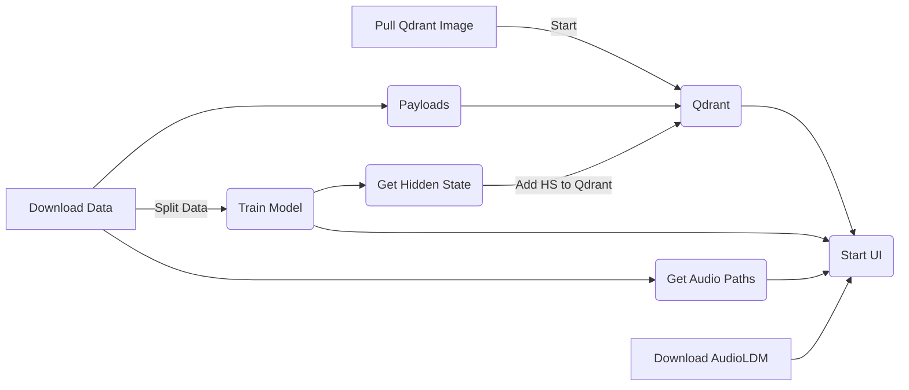

# audiodb


[](https://mybinder.org/v2/gh/ramonpzg/audiodb/HEAD)

## Table of Contents

1. Overview
2. The Data
3. The Tools
4. Setup
5. Next Steps

## 1. Overview




The goal of this project is build a music recommender system using tunes created 
from a diffusion model and then find the ten most similar recommendations 
from real songs of different artists. The key tool enabling this recommender system is 
[Qdrant](https://qdrant.tech/), "a vector similarity search engine that provides a 
production-ready service with a convenient API to store, search, and manage points - vectors 
with an additional payload."

In order to get the hidder layer, or what is often called the embedding, we will train
a transformer on how to classify different music genres. Once we have a model, we will extract
the hidden layer, add it to Qdrant, define our similarity metric, and begin creating 
our own tunes.

There are several ways to go about creating a diffusion model that can end up being 
read as an audio file, and the one we will use here is is a Text-to-Audio model called, 
[AudioLDM](https://huggingface.co/cvssp/audioldm). This model (as stated on HugginFace) 
"is a latent text-to-audio diffusion model capable of generating realistic audio 
samples given any text input. It is available in the 🧨 Diffusers library from v0.15.0 onwards."

To create our classifier, we will use Facebook's famous 
[Wav2Vec2-Base](https://huggingface.co/facebook/wav2vec2-base) model and fine-tune it 
on a set of songs of about 30-seconds each. We will be using the transformers library 
to fine-tune our model and, while the data is coming from a particular kaggle account, 
you can swap it for another dataset a follow along as well.

We will be using streamlit for our user interface and dvc to create a straighforward
pipeline for our steps. It is important to note that, when running this tutorial on a 
local machine, the training of the model, and the time it takes the diffuser to create 
a tune, can vary quite significantly.

Lastly, the full end-to-end tutorial can be found on Notebook `05_pipeline.ipynb`, and please note,
this is still a work in progress. 

This tutorial was created on a personal laptop with 16 cores, 32GB of RAM, and an Nvidia RTX 2060.

Once you have the environment set up and the unzipped dataset directory, `Audio`, 
inside the `data` directory, you will be able to reproduce the tutorial with the 
following commands.

```sh
## 1
mkdir models data/hidden_state data/processed data/payloads data/external

## 2
`docker pull qdrant/qdrant`

## 3
docker run -p 6333:6333 \
    -v $(pwd)/qdrant_storage:/qdrant/storage \
    qdrant/qdrant

## 4
`dvc repro`
```

## 2. The Data

The dataset can be found on [Kaggle](https://www.kaggle.com/datasets/carlossalazar65/tropical-genres-dataset), 
and you will need to have an account (or create one) to download it. Since music is subject 
to many copyright laws and other legalities, it contains no information other than the many ~30-second clips 
of songs from genres such as Bachata, Merengue, Salsa, Cumbia, and Vallenato. The dataset is particularly appealing 
to me as the first two genres, Bachata and Merengue, were both born in my home country, 
the Dominican Republic.

A few things to note:
- Since we do not know the artist or the name of the song (and because song recognition APIs
are actually very difficult to find and/or not free to use), we will use Fake names generated by `faker` 
to fill in the artist box and we will leave the name of the song in blank for now.
- The dataset does not contain an index so we will create one consisting of 5 random digits to 
help with the design of this project.
- Ideally the recommended tunes would be loaded from the database or a would be pulled from an URL, so 
that part is not available yet but it is coming soon.


## 3. The Tools

- [`Qdrant`](https://qdrant.tech/) - " is a vector similarity search engine that provides a 
production-ready service with a convenient API to store, search, and manage points - vectors 
with an additional payload."
- [`🤗 transformers`](https://huggingface.co/docs/transformers/index) - provides APIs and tools 
to easily download and train state-of-the-art pretrained models. Using pretrained models can reduce 
your compute costs, carbon footprint, and save you the time and resources required to train a model from scratch.
- [`🤗 datasets`](https://huggingface.co/docs/datasets/v2.11.0/en/index) - "is a library for easily 
accessing and sharing datasets for Audio, Computer Vision, and Natural Language Processing (NLP) tasks."
- [`🤗 difussers`](https://huggingface.co/docs/diffusers/v0.15.0/en/index) - "is the go-to library for 
state-of-the-art pretrained diffusion models for generating images, audio, and even 3D structures of molecules."
- [`pandas`](https://pandas.pydata.org/) - "is a fast, powerful, flexible and easy to use open source data 
analysis and manipulation tool, built on top of the Python programming language."
- [`NumPy`](https://numpy.org/doc/stable/) - "is a Python library that provides a multidimensional array object, various derived 
objects (such as masked arrays and matrices), and an assortment of routines for fast operations on arrays, 
including mathematical, logical, shape manipulation, sorting, selecting, I/O, discrete Fourier transforms, 
basic linear algebra, basic statistical operations, random simulation and much more."
- [`PyTorch`](https://pytorch.org/docs/stable/index.html) - "is an optimized tensor library for deep learning using GPUs and CPUs."
- [`Faker`](https://faker.readthedocs.io/en/master/) - "is a Python package that generates fake data for 
you. Whether you need to bootstrap your database, create good-looking XML documents, fill-in your persistence 
to stress test it, or anonymize data taken from a production service, Faker is for you."
- [`Streamlit`](https://docs.streamlit.io/) - "is an open-source Python library that makes it easy to create 
and share beautiful, custom web apps for machine learning and data science. In just a few minutes you can 
build and deploy powerful data apps."
- [`dvc pipelines`](https://dvc.org/doc/user-guide/pipelines) - "DVC Pipelines help you define your workflow stages in a 
standard YAML format (.dvc and dvc.yaml files), making your pipelines more manageable and consistent to reproduce."


## 4. Setup

First, make sure you have [docker](https://docs.docker.com/get-docker/) installed as this is a prerequisite to use Qdrant.

Next, you get started using Qdrant by running the following commands.

```sh
## 1
docker pull qdrant/qdrant

## 2
docker run -p 6333:6333 \
    -v $(pwd)/qdrant_storage:/qdrant/storage \
    qdrant/qdrant
```

Please note, you will need to run the first command above before we get started, but the second is not necessary. 

### Conda Users

#### First Step

Open up your terminal and navigate to a directory of your choosing in your computer. 
Once there, run the following command to get the code for the session.

```sh
 git clone git@github.com:ramonpzg/audiodb.git
```

Conversely, you can click on the green `download` button at the top and donwload all 
files to your desired folder/directory. Once you download it, unzip it and move on to 
the second step.

#### Second Step

To get all dependencies, packages and everything else that would be useful to reproduce 
this project, you can recreate the environment by first going into the directory for the project.

```sh
cd audiodb
```

Then you will need to create an environment with all of the dependancies needed 
for the session by running the following command.

```sh
conda create -n vdb_audio python=3.10
conda activate vdb_audio
conda install --yes --file requirements.txt
# OR
pip install -f requirements.txt


## Conversely

python -m venv venv

python -m venv venv
source venv/bin/activate
pip install -f requirements.txt
```

#### Third Step

Open up VSCode or Jupyter Lab and you should be ready to go.

```sh
jupyter lab

# or

code .
```

## Running the App

If you'd like to see a nicer version (with memes) of the answers for this challenge. Run the following command in your terminal and inside the environment for this project.

```sh
streamlit run src/app.py
```

A new window should pop up in no time. Otherwise, you can go to http://localhost:8501 and view the app there.


## 5. Next Steps

- [ ] Fine-tune diffuser model
- [ ] Get actual artists for each song
- [ ] Add more songs and artists
- [ ] Create a better pipeline with MetaFlow
- [ ] Add explainability step
- [ ] Add DB for queries used and outputs
- [ ] Add human-in-the-loop feedback mechanism for data flywheel